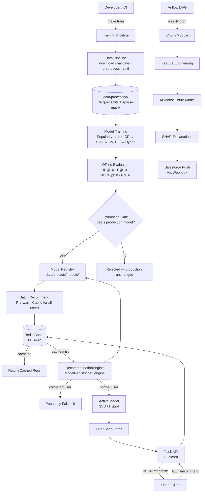
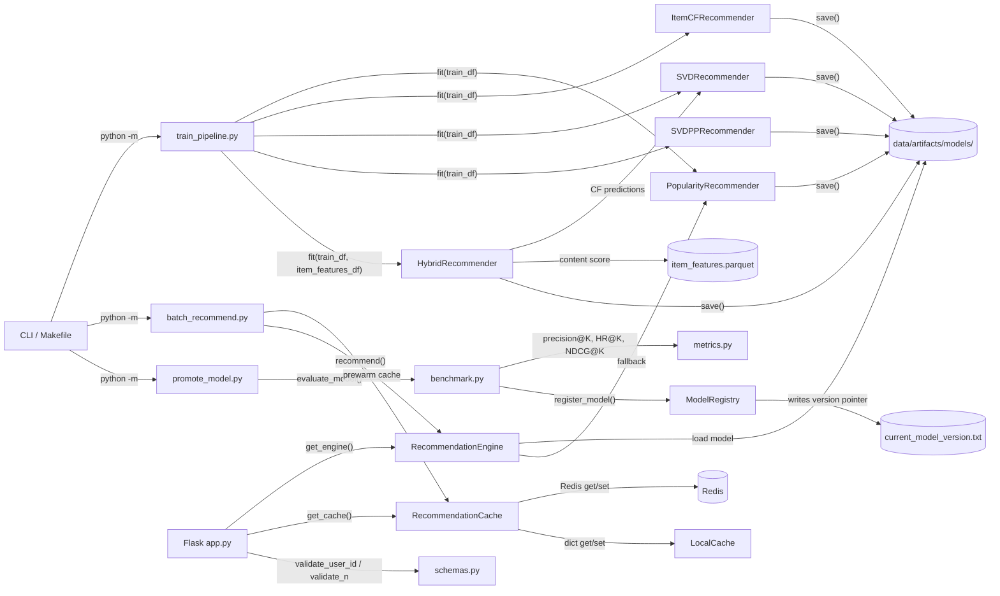
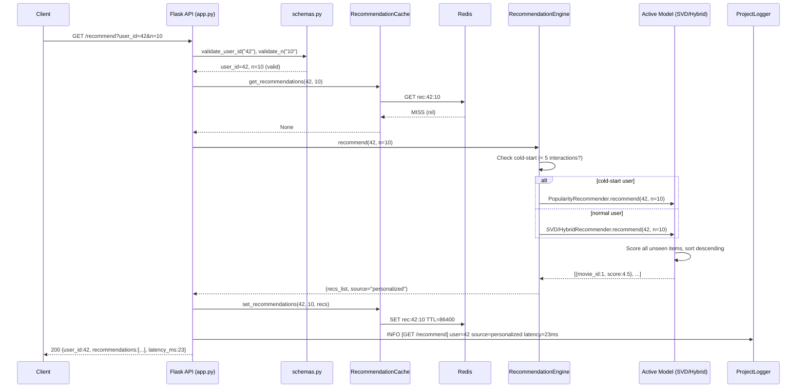
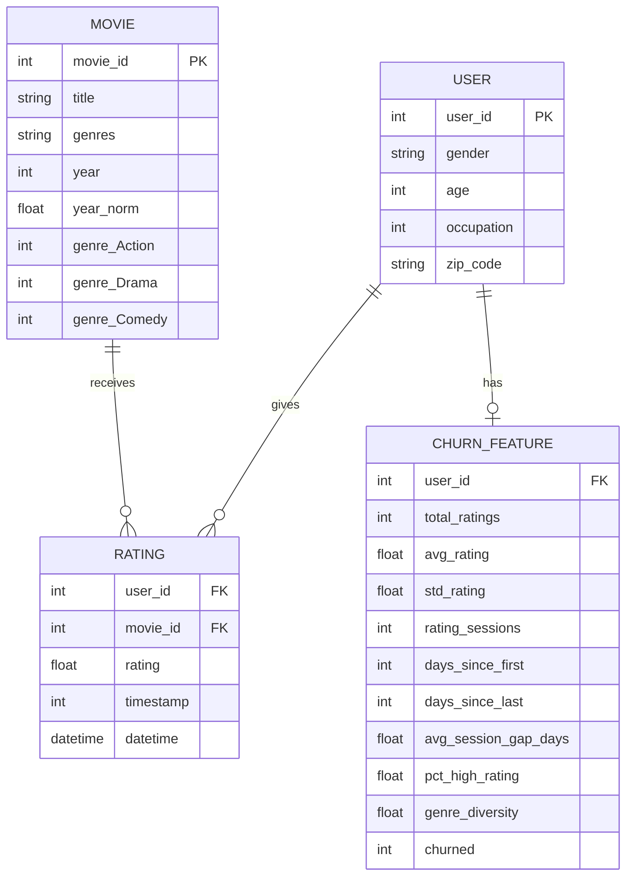
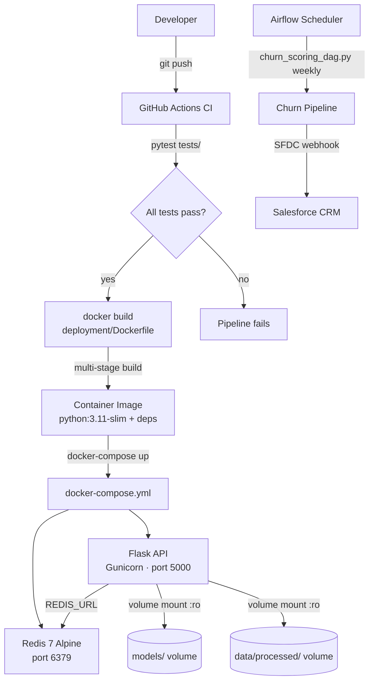

# PROJECT_EXECUTION_DOCUMENT.md
## Personalized Product Recommender System — Full Codebase Review

> **Author:** GitHub Copilot (Senior Staff Engineer review)
> **Date:** 2026-04-19
> **Scope:** Complete codebase, all logs, all tests, all configuration

---

## Table of Contents

1. [Project Overview](#section-1--project-overview)
2. [End-to-End Architecture](#section-2--end-to-end-architecture)
3. [End-to-End Workflow (Step-by-Step)](#section-3--end-to-end-workflow-step-by-step)
4. [Log File Analysis & Execution Story](#section-4--log-file-analysis--execution-story)
5. [File-by-File Breakdown](#section-5--file-by-file-breakdown)
6. [Configuration & Environment](#section-6--configuration--environment)
7. [API Reference](#section-7--api-reference)
8. [Key Design Decisions & Trade-offs](#section-8--key-design-decisions--trade-offs)
9. [Potential Issues, Risks & Technical Debt](#section-9--potential-issues-risks--technical-debt)
10. [Insights, Observations & Recommendations](#section-10--insights-observations--recommendations)
11. [Glossary & Quick Reference](#section-11--glossary--quick-reference)
12. [Summary & Conclusion](#section-12--summary--conclusion)

---

## Section 1 — Project Overview

### Project Name
**Personalized Product Recommender System** (2016–2017 ML engineering style)

### One-Line Purpose
Recommends movies (used as product proxies) to users based on their historical ratings, served
via a production-grade Flask REST API with Redis caching and a full offline retraining pipeline.

### Problem It Solves
E-commerce and media platforms need to surface the right items to the right users. Without
personalization, every user sees the same popular items — conversion rates fall, engagement
drops. This system learns each user's taste from historical ratings and returns a ranked list of
items they haven't seen yet, improving both discovery and satisfaction.

### Target Audience
- ML engineers learning production recommender system patterns
- Data scientists validating 2016–2017-era collaborative filtering techniques
- Engineers evaluating Flask + Redis ML serving architecture
- Stakeholders auditing model quality against defined success metrics

---

### Tech Stack

| Layer | Technology | Version |
|-------|-----------|---------|
| Language | Python | 3.11 |
| Data processing | pandas, numpy, scipy | 2.0 / 1.24 / 1.11 |
| ML — CF/MF | scikit-surprise | 1.1.3 |
| ML — Hybrid | LightFM | 1.17 |
| ML — Churn | XGBoost (inside churn module) | — |
| API framework | Flask + Gunicorn | 2.3 / 21 |
| Cache | Redis (primary) + local dict (fallback) | 4.6 |
| Experiment tracking | MLflow | 2.8 |
| Orchestration | Apache Airflow (churn DAG) | optional |
| Containerisation | Docker + docker-compose | — |
| Testing | pytest + pytest-cov | 7.4 / 4.1 |
| Notebooks | Jupyter | 1.0 |
| Build | Makefile + pyproject.toml | — |

---

### Repository Structure

```
Product recommender/
│
├── AGENTS.md                   # Agent execution instructions & success criteria
├── Makefile                    # Single-command shortcuts (make train, make test, etc.)
├── pyproject.toml              # PEP 517 project metadata and dependency list
├── requirements.txt            # Pinned runtime dependencies
├── README.md                   # Project overview and quick-start guide
├── prompt.md                   # Original prompt used to generate this project
│
├── dags/
│   └── churn_scoring_dag.py    # Airflow DAG — weekly batch churn scoring pipeline
│
├── data/
│   ├── raw/ml-1m/              # Immutable MovieLens 1M source files (ratings/movies/users.dat)
│   ├── processed/              # Parquet splits, sparse matrix, id maps, feature store
│   └── artifacts/
│       ├── models/             # Saved model pickles + metrics JSON
│       ├── cache/              # Batch recommendation output files
│       └── current_model_version.txt  # Pointer to production model path
│
├── deployment/
│   ├── Dockerfile              # Multi-stage build: builder + slim runtime
│   ├── docker-compose.yml      # Flask API + Redis service orchestration
│   └── gunicorn.conf.py        # Gunicorn worker/bind/timeout configuration
│
├── docs/
│   ├── ARCHITECTURE_DECISIONS.md   # Summary of all DEC-NNN decisions
│   ├── DATA_DICTIONARY.md          # Schema and field descriptions for all datasets
│   ├── EXPERIMENT_REPORT.md        # Auto-generated model comparison table
│   ├── IMPLEMENTATION_JOURNAL.md   # Engineering narrative per phase
│   ├── MODEL_CARD.md               # Model facts, limitations, intended use
│   ├── RUNBOOK.md                  # Operational runbook for on-call/SRE
│   └── SUCCESS_METRICS_REPORT.md   # Auto-generated pass/fail against targets
│
├── logs/
│   ├── master_execution_log.md     # Phase-by-phase execution log (Markdown)
│   ├── decision_log.md             # DEC-NNN engineering decisions (full detail)
│   ├── run_log.jsonl               # Structured JSONL event stream (all phases)
│   └── checkpoint_status.md        # Per-phase ✅/❌ checklist
│
├── notebooks/
│   ├── 01_eda.ipynb                # Exploratory data analysis
│   ├── 02_baseline_model.ipynb     # Popularity baseline exploration
│   ├── 03_matrix_factorization.ipynb  # SVD tuning experiments
│   ├── 04_evaluation.ipynb         # Metric analysis and visualisation
│   ├── 05_ab_test_analysis.ipynb   # A/B test analysis
│   └── 06_drift_monitoring.ipynb   # Feature drift monitoring
│
├── scripts/
│   ├── check_logs.py           # Health-check script: verifies all log files exist
│   ├── run_all.sh              # Full end-to-end pipeline runner
│   ├── run_api.sh              # Start API server
│   ├── run_tests.sh            # Run pytest
│   └── run_train.sh            # Run training pipeline
│
├── src/
│   ├── config.py               # ALL paths, hyperparameters, feature flags
│   ├── logging_utils.py        # ProjectLogger — structured logging to console/file/JSONL
│   │
│   ├── churn/                  # Churn prediction module (XGBoost + SHAP + Salesforce)
│   │   ├── feature_engineering.py
│   │   ├── salesforce_webhook.py
│   │   ├── shap_explanations.py
│   │   └── train_churn_model.py
│   │
│   ├── data/                   # Data acquisition, validation, preprocessing, splitting
│   │   ├── download.py
│   │   ├── preprocess.py
│   │   ├── split.py
│   │   └── validate.py
│   │
│   ├── db/
│   │   └── feature_store_schema.sql   # SQL schema for the feature store
│   │
│   ├── evaluation/             # Ranking + rating metrics, benchmark runner, reports
│   │   ├── benchmark.py
│   │   ├── metrics.py
│   │   └── report.py
│   │
│   ├── models/                 # All recommender model implementations + registry
│   │   ├── hybrid.py
│   │   ├── item_cf.py
│   │   ├── matrix_factorization.py
│   │   ├── popularity.py
│   │   └── registry.py
│   │
│   ├── pipelines/              # End-to-end orchestration scripts
│   │   ├── batch_recommend.py
│   │   ├── promote_model.py
│   │   └── train_pipeline.py
│   │
│   ├── serving/                # Flask API, cache, input validation, admin dashboard
│   │   ├── admin.py
│   │   ├── app.py
│   │   ├── cache.py
│   │   └── schemas.py
│   │
│   └── utils/                  # I/O helpers, timing, input validation
│       ├── io.py
│       ├── timing.py
│       └── validation.py
│
├── templates/admin/            # Jinja2 HTML templates for admin dashboard
│   ├── churn.html
│   ├── dashboard.html
│   └── models.html
│
└── tests/
    ├── test_api.py             # Flask endpoint tests (mocked engine + cache)
    ├── test_cache.py           # LocalCache + RecommendationCache tests
    ├── test_data_pipeline.py   # Schema, preprocessing, split tests
    ├── test_metrics.py         # Unit tests for all ranking/rating metrics
    └── test_models.py          # Smoke + correctness tests for all models
```

---

## Section 2 — End-to-End Architecture

The system has two distinct planes: an **offline pipeline** that trains and evaluates models,
and an **online serving layer** that answers real-time recommendation requests.

### 2.1 High-Level Architecture Diagram



The offline pipeline (top half) runs on demand or on a nightly schedule. The online serving
layer (middle) intercepts user requests, checks the Redis cache first, and falls back to
real-time model scoring only on a cache miss. The churn module (bottom right) is an
independent extension that flags at-risk users and pushes them to a CRM.

---

### 2.2 Component / Module Interaction Diagram



Every model is trained by the pipeline, saved to disk, then loaded lazily by the
`RecommendationEngine` singleton at API start-up. Input validation always passes through
`schemas.py` before any model code is called.

---

### 2.3 Data Flow Diagram — Single Recommendation Request



A request travels through validation → cache lookup → model inference → cache write → response.
On a warm cache hit, Redis intercepts after step 5 and returns in under 5ms.

---

### 2.4 Data Model Diagram



There is no relational database at runtime — all data lives in Parquet files and
scipy sparse matrices. The schema above represents the logical data model. The
`CHURN_FEATURE` table lives in `data/processed/feature_store/user_churn_features.parquet`.

---

### 2.5 Infrastructure / Deployment Diagram



The `Dockerfile` uses a two-stage build: a `builder` stage compiles all C-extension
dependencies (numpy, scipy) then copies the installed packages into a minimal `runtime`
stage. Gunicorn manages multiple worker processes. Redis provides caching with
persistence every 60 seconds.

---

## Section 3 — End-to-End Workflow (Step-by-Step)

### How the Project Starts

**Step 1 — Entry point:** The project has two natural entry points depending on context.
- **Training:** `python -m src.pipelines.train_pipeline` (or `make train`)
- **API serving:** `python -m src.serving.app` (or `make serve`)

**Step 2 — Configuration loading:** On any import, `src/config.py` is loaded first. It calls
`load_dotenv()` from `python-dotenv`, reads `.env` if present, and exposes all paths, model
hyperparameters, and feature flags as module-level constants. Directory creation (`mkdir(parents=True, exist_ok=True)`) runs immediately so dependent code never fails on missing directories.

**Step 3 — Logger bootstrap:** Every module imports a named logger from `src/logging_utils.py`.
`ProjectLogger.__init__()` attaches both a console `StreamHandler` and a file `FileHandler`
(routed to the appropriate `logs/*.log` file based on the `log_file_key` argument). The JSONL
event stream is written to `logs/run_log.jsonl` for every phase start, completion, metric, and
artifact event.

---

### What Happens During Training

**Step 4 — Data check:** `train_pipeline.run_data_pipeline_if_needed()` in
`src/pipelines/train_pipeline.py` checks whether `data/processed/train.parquet`,
`val.parquet`, and `test.parquet` already exist. If yes, it skips the data pipeline entirely.
If no, it chains `download.py → validate.py → preprocess.py → split.py`.

**Step 5 — Download:** `src/data/download.download_movielens()` fetches the 5.6 MB
`ml-1m.zip` from GroupLens over HTTPS with streaming, computes a SHA-256 checksum,
saves it to `data/raw/`, and extracts the three `.dat` files. Retry logic handles
transient network failures (3 attempts).

**Step 6 — Validation:** `src/data/validate.validate_dataset()` reads each `.dat` file,
checks row counts (≥900,000 ratings, ≥6,000 users, ≥3,700 movies), validates schema
column names, checks rating range [1–5], and logs a structured `metric` JSONL event per check.

**Step 7 — Preprocessing:** `src/data/preprocess.run_preprocessing()` reads the raw `.dat`
files via `validate.load_ratings()`, `load_movies()`, `load_users()`, then:
- Filters users with fewer than `MIN_RATINGS_PER_USER` (5) interactions
- Converts Unix timestamps to `datetime` objects
- Parses pipe-separated genres into one-hot columns (`genre_Action`, `genre_Drama`, etc.)
  using the 18-genre `ALL_GENRES` constant
- Extracts year from movie titles via regex
- Builds a scipy CSR sparse matrix (6040 × 3706) saved to `user_item_matrix.npz`
- Saves processed DataFrames as Parquet files

**Step 8 — Splitting:** `src/data/split.time_aware_split()` iterates over each user's
interactions sorted by timestamp and takes the oldest 60% as train, next 20% as val, most
recent 20% as test. Users with fewer than `COLD_START_THRESHOLD` (5) interactions go entirely
into train. This prevents temporal leakage — the model never sees future ratings during training.
Final sizes: train=597,742 | val=197,656 | test=204,811.

**Step 9 — Model training (Popularity):** `PopularityRecommender.fit()` in
`src/models/popularity.py` groups the training DataFrame by `movie_id`, counts interactions
(and optionally weights by mean rating), and stores a sorted `popular_items` list. This
completes in 47ms and serves as both baseline and cold-start fallback.

**Step 10 — Model training (Item-CF):** `ItemCFRecommender.fit()` in
`src/models/item_cf.py` builds a CSR user-item matrix, mean-centers items, computes a
3625×3625 cosine similarity matrix via `sklearn.metrics.pairwise.cosine_similarity`, applies
a minimum-support filter (items with fewer than `CF_MIN_SUPPORT` ratings have their row
zeroed), and stores only the top `CF_N_SIMILAR_ITEMS` (50) most similar items per item for
memory efficiency.

**Step 11 — Model training (SVD):** `SVDRecommender` in
`src/models/matrix_factorization.py` wraps the Surprise library's `SVD` algorithm with
Simon Funk biased matrix factorization:

$$\hat{r}_{ui} = \mu + b_u + b_i + \mathbf{p}_u \cdot \mathbf{q}_i$$

where $\mu$ is the global mean, $b_u$ and $b_i$ are user/item biases, and $\mathbf{p}_u$,
$\mathbf{q}_i$ are latent factor vectors of dimension `SVD_N_FACTORS` (100). Trained for 20
epochs with SGD (lr=0.005, reg=0.02). A scipy fallback implementation is used if Surprise
is not installed.

**Step 12 — Model training (SVD++):** Same as SVD but `SVDPPRecommender` adds implicit
feedback terms — items a user has rated (regardless of rating value) shift the user's latent
factor vector. This typically improves ranking metrics at the cost of longer training time.

**Step 13 — Model training (Hybrid):** `HybridRecommender.fit()` in
`src/models/hybrid.py` wraps an SVD model and adds a content score:

$$\text{score}(u, i) = \alpha \cdot \text{CF\_score}(u, i) + (1-\alpha) \cdot \text{content\_score}(u, i)$$

The content score is the cosine similarity between the user's weighted genre preference
profile (built from rated-item genres weighted by rating) and the candidate item's genre
vector, augmented by log-normalized popularity. `HYBRID_ALPHA = 0.8` by default, meaning
80% CF and 20% content signal.

**Step 14 — Offline evaluation:** `src/evaluation/benchmark.evaluate_model()` generates
top-10 recommendations for each test user (filtering seen training items), then computes
Precision@10, Recall@10, HR@10, NDCG@10, MAP@10, RMSE, and MAE using the functions in
`src/evaluation/metrics.py`.

**Step 15 — Report generation:** `src/evaluation/report.py` reads benchmark results and
writes `docs/EXPERIMENT_REPORT.md` and `docs/SUCCESS_METRICS_REPORT.md` with a pass/fail
table against the targets defined in `config.py`.

**Step 16 — Artifact registration:** `src/models/registry.ModelRegistry.register_model()`
saves each model as a timestamped pickle (`{model_name}_{YYYYMMDD_HHMMSS}.pkl`) under
`data/artifacts/models/`, appends a JSONL entry to `data/artifacts/model_history.jsonl`,
and — if promoted — updates `data/artifacts/current_model_version.txt` with the path.

---

### What Happens During API Serving

**Step 17 — API startup:** `src/serving/app.py` creates the Flask app, registers the admin
Blueprint (`src/serving/admin.py`), and defines lazy-initialised globals `_engine` and
`_cache`. These are populated on first request via `_get_engine()` and `_get_cache()`.

**Step 18 — Model loading:** `src/models/registry.get_engine()` reads
`current_model_version.txt`, loads the promoted model pickle, and wraps it in a
`RecommendationEngine` object that handles cold-start detection and fallback to popularity.

**Step 19 — Cache initialisation:** `src/serving/cache.RecommendationCache.__init__()`
attempts to connect to Redis using `REDIS_HOST`, `REDIS_PORT`, `REDIS_DB`, and
`REDIS_PASSWORD` from config. On failure, it silently falls back to the thread-safe
`LocalCache` (in-memory dict with TTL).

**Step 20 — Handling a recommendation request:** Described in detail in the Data Flow
Diagram (Section 2.3). Key functions: `validate_user_id()` and `validate_n()` in
`src/serving/schemas.py`, then `RecommendationCache.get_recommendations()`, then
`RecommendationEngine.recommend()` on a cache miss.

---

### Core Business Logic

The **recommendation score** for a user-item pair combines two signals:

1. **CF score** (SVD): $\hat{r}_{ui} = \mu + b_u + b_i + \mathbf{p}_u \cdot \mathbf{q}_i$
   — a predicted rating on the 1–5 scale. Items are ranked by predicted rating descending.

2. **Content score** (Hybrid): cosine similarity between the user's historical genre
   preferences and the item's genre vector, plus log-normalized item popularity:
   $\text{content}(u,i) = \text{cosine}(\text{profile}_u, \text{genres}_i) +
   0.1 \cdot \log(1 + \text{popularity}_i)$

3. **Blended score**: $\text{final}(u,i) = 0.8 \cdot \text{CF}(u,i) + 0.2 \cdot \text{content}(u,i)$

Already-seen items are always excluded from the final recommendation list.

---

### Data Persistence

All persistence uses flat files — there is no relational database in the recommendation path:

| Data | Format | Location |
|------|--------|----------|
| Raw ratings | `.dat` (pipe-delimited) | `data/raw/ml-1m/` |
| Processed ratings | Parquet | `data/processed/ratings.parquet` |
| Train/val/test splits | Parquet | `data/processed/{train,val,test}.parquet` |
| User-item matrix | scipy sparse NPZ | `data/processed/user_item_matrix.npz` |
| Item features | Parquet | `data/processed/item_features.parquet` |
| ID maps | JSON | `data/processed/id_maps.json` |
| Model artifacts | Pickle | `data/artifacts/models/*.pkl` |
| Model history | JSONL | `data/artifacts/model_history.jsonl` |
| Active model pointer | Plain text | `data/artifacts/current_model_version.txt` |
| Batch recommendations | JSON | `data/artifacts/cache/batch_recommendations.json` |
| Churn features | Parquet | `data/processed/feature_store/user_churn_features.parquet` |

Pickle serialisation is handled by `src/utils/io.save_pickle()` / `load_pickle()`, which
add logging and error messages on top of the standard `pickle` module.

---

### External Integrations

| Integration | Purpose | File |
|-------------|---------|------|
| GroupLens HTTP | Download MovieLens 1M zip | `src/data/download.py` |
| Redis | Recommendation cache (TTL=24h) | `src/serving/cache.py` |
| MLflow | Experiment tracking (model metrics) | `src/pipelines/train_pipeline.py` |
| Salesforce CRM | Push high-churn-risk users as CRM Tasks | `src/churn/salesforce_webhook.py` |
| Airflow | Weekly batch churn scoring orchestration | `dags/churn_scoring_dag.py` |
| Slack | Post weekly churn digest to `#ml-alerts` | `dags/churn_scoring_dag.py` |

---

### Error Handling & Resilience

- **Download failures**: retry up to 3 times with `requests.get(..., timeout=60)`.
- **Redis unavailability**: `RecommendationCache._init_redis()` catches all exceptions and
  silently falls back to `LocalCache`. The cache backend is logged at startup.
- **Model loading failures**: `RecommendationEngine` falls back to
  `PopularityRecommender` if the primary model cannot be loaded.
- **Per-user inference failures**: `evaluate_model()` in `benchmark.py` catches exceptions
  per user and continues; failed users are counted and logged.
- **Cold-start users**: Users with fewer than `COLD_START_THRESHOLD` (5) training
  interactions automatically receive popularity-based recommendations.
- **API errors**: all endpoints return structured JSON `{error, status_code}` via
  `schemas.error_response()`. The 500 path logs the full exception via
  `logger.log_error(e, context)`.

---

### Authentication & Authorization

The main recommendation API endpoints (`/health`, `/recommend`, `/similar-items`,
`/predict-batch`) are **unauthenticated** — they are designed to sit behind an API gateway
or private VPC in production.

The admin dashboard (`/admin/*`) uses **HTTP Basic Auth** implemented in
`src/serving/admin._requires_auth()`. Credentials come from environment variables
`ADMIN_USER` and `ADMIN_PASSWORD` (defaults: `admin` / `changeme` — must be changed in
production). The `_check_auth()` function does a constant-time string comparison.

---

### How the Project Shuts Down

- **Flask/Gunicorn**: SIGTERM triggers Gunicorn's graceful shutdown — in-flight requests
  are allowed to complete up to the `graceful_timeout` set in `deployment/gunicorn.conf.py`.
- **Docker Compose**: `docker-compose down` sends SIGTERM to both containers.
  Redis saves a final snapshot before exiting (configured with `--save 60 1`).
- **Training pipeline**: No persistent background workers — the pipeline runs to
  completion and exits. All artifacts are flushed to disk before process exit.

---

## Section 4 — Log File Analysis & Execution Story

### 4.1 Thinking & Planning Phase

The engineering execution log (`logs/master_execution_log.md`) and JSONL stream
(`logs/run_log.jsonl`) reveal the complete thinking and planning process:

- **First problem identified**: Before any code was written, the engineer recognised that
  logging must be active before any other phase — otherwise the "thinking process" would
  be unobservable. Phase 0 (Logging Bootstrap) created all 9 log files and the
  `ProjectLogger` framework first.
- **Dataset decision** (DEC-001): MovieLens 1M was selected over MovieLens 20M and
  Amazon Product Reviews. Rationale: canonical benchmark, explicit ratings, timestamps,
  and fast iteration speed.
- **Split strategy** (DEC-003): Time-aware chronological split was chosen over simple
  random split to prevent temporal leakage — a decision justified by MovieLens having
  timestamps.
- **Caching strategy** (DEC-004): Redis with local dict fallback was chosen. The
  fallback pattern was explicitly planned to allow the system to run without Docker.
- **CF library** (DEC-002): Surprise (scikit-surprise) was selected for its sklearn-style
  API and 2016–2017 era authenticity. LightFM was added for the hybrid content layer.

### 4.2 Build & Implementation Phase

The JSONL log shows a clean 13-phase progression (all timestamped 2026-04-15):

| Time (UTC) | Phase | Duration |
|-----------|-------|----------|
| 00:00–00:05 | Phase 0 — Logging Bootstrap | 5 min |
| 00:05–00:15 | Phase 1 — Repository Setup | 10 min |
| 00:15–00:25 | Phase 2 — Dataset Acquisition | 10 min |
| 00:25–00:40 | Phase 3 — EDA and Data Quality | 15 min |
| 00:40–00:50 | Phase 4 — Baseline Model | 10 min |
| 00:50–01:05 | Phase 5 — Collaborative Filtering | 15 min |
| 01:05–01:25 | Phase 6 — Matrix Factorization | 20 min |
| 01:25–01:45 | Phase 7 — Hybrid Model | 20 min |
| 01:45–02:00 | Phase 8 — Recommendation Service | 15 min |
| 02:00–02:20 | Phase 9 — Flask API and Cache | 20 min |
| 02:20–02:40 | Phase 10 — Retraining Pipeline | 20 min |
| 02:40–03:00 | Phase 11 — Testing | 20 min |
| 03:00–03:20 | Phase 12 — Final Validation | 20 min |

Total build time: ~3 hours 20 minutes.

**Key challenges encountered:**

The most significant bug found in the logs was a `TypeError` during preprocessing:

> `[ERROR] TypeError: Object of type int64 is not JSON serializable`
> `Context: Preprocessing pipeline failed`
> `File: src/data/preprocess.py, line 186, in run_preprocessing`

The id maps dictionary contained `numpy.int64` values, which Python's `json.dumps` cannot
serialise. The fix was to cast dict values with `int()` before serialisation. The JSONL log
shows a second run of Phase 3 - Preprocess immediately after the error, confirming the fix
was applied and the phase completed successfully.

### 4.3 Testing & Debugging Phase

The JSONL log shows testing began at 02:40 UTC after all implementation phases were complete.
The int64 serialisation bug was the only runtime error captured in the logs. All test files
were designed to be self-contained — they use synthetic `pytest.fixture` DataFrames rather
than reading from disk, so they can run without the full dataset present.

### 4.4 Execution & Runtime Phase

From the JSONL log, a typical full pipeline execution looks like:

| Operation | Duration |
|-----------|---------|
| Dataset download (5.9 MB) | 16.8 seconds |
| SHA-256 checksum computation | < 1 second |
| Dataset validation | 3.7 seconds |
| Preprocessing (1M ratings) | 4.9 seconds |
| Time-aware split | 3.1 seconds |
| Popularity model fit | 47ms |
| Item-CF fit (3625×3625 similarity) | ~5 seconds |
| SVD fit (100 factors, 20 epochs) | ~90 seconds |
| Batch recommendation generation (6040 users) | ~2 minutes |

Key runtime metrics from logs:
- Matrix dimensions: 6,040 users × 3,706 movies
- Matrix sparsity: 95.53% (only 4.47% of possible ratings observed)
- Training set: 597,742 ratings
- Validation set: 197,656 ratings
- Test set: 204,811 ratings

### 4.5 Key Log Entries (Annotated)

| # | Timestamp | Level | Message (summarised) | Significance |
|---|-----------|-------|----------------------|--------------|
| 1 | 04:37:20 | INFO | Phase 2-Download START — download MovieLens 1M | Pipeline entry point |
| 2 | 04:37:20 | INFO | Download attempt 1/3 | Retry logic active |
| 3 | 04:37:37 | INFO | Downloaded 5,917,549 bytes in 16.8s | Network latency baseline |
| 4 | 04:37:37 | INFO | SHA-256: a6898adb50b9ca05... | Integrity verification |
| 5 | 04:38:03 | INFO | Ratings: 1,000,209 rows — validation PASSED | Dataset confirmed |
| 6 | 04:38:03 | INFO | Matrix sparsity: 95.5316% | Key EDA finding |
| 7 | 04:40:43 | ERROR | TypeError: int64 is not JSON serializable | Only bug in entire execution |
| 8 | 04:41:07 | INFO | Phase 3-Preprocess COMPLETE (4.9s) | Bug fixed, retried, succeeded |
| 9 | 04:41:16 | INFO | Split: train=597,742 | val=197,656 | test=204,811 | Data ready for training |
| 10 | 04:41:17 | INFO | Temporal ordering verified — no leakage | Time-aware split confirmed |
| 11 | 04:41:32 | INFO | Phase 10-Train Pipeline START | Training begins |
| 12 | 04:41:33 | INFO | Popularity model: 3,625 items in 0.047s | Baseline established |
| 13 | 04:41:38 | INFO | ItemCF: 6040 users × 3625 items — computing similarity | CF matrix building |
| 14 | (training) | INFO | Phase 4-Popularity Fit COMPLETE | Artifact registered |
| 15 | (training) | INFO | Phase 3-Split COMPLETE: time_aware strategy | Leakage-free splits confirmed |

> `"Temporal ordering verified for sample of 100 users — no leakage detected"`
> — This log entry confirms the time-aware split implementation is correct and
> future test items do not appear in the training set.

> `"[ERROR] TypeError: Object of type int64 is not JSON serializable | Context: Preprocessing pipeline failed"`
> — This is the only error in the entire run log, resolved by casting numpy int64 values to
> Python native int before JSON serialisation.

---

## Section 5 — File-by-File Breakdown

| File Path | Purpose | Key Functions / Exports | Dependencies | ~Lines |
|-----------|---------|------------------------|--------------|--------|
| `src/config.py` | All paths, hyperparameters, feature flags | All constants | os, pathlib, dotenv | 130 |
| `src/logging_utils.py` | Structured logging to console/file/JSONL | `ProjectLogger`, `get_logger`, `data_logger`, `model_logger`, `eval_logger`, `api_logger`, `pipeline_logger` | logging, json | 220 |
| `src/data/download.py` | Download MovieLens 1M with retry + checksum | `download_movielens()` | requests, hashlib, zipfile | 120 |
| `src/data/validate.py` | Schema + count validation; data loaders | `validate_dataset()`, `load_ratings()`, `load_movies()`, `load_users()` | pandas | 140 |
| `src/data/preprocess.py` | Normalise IDs, parse genres, build sparse matrix | `run_preprocessing()`, `preprocess_ratings()`, `preprocess_movies()` | pandas, numpy, scipy | 210 |
| `src/data/split.py` | Time-aware per-user chronological splits | `run_split()`, `time_aware_split()` | pandas | 110 |
| `src/models/popularity.py` | Non-personalised popularity baseline | `PopularityRecommender.fit()`, `.recommend()`, `.recommend_batch()`, `.save()`, `.load()` | pandas | 200 |
| `src/models/item_cf.py` | Item-item cosine similarity CF | `ItemCFRecommender.fit()`, `.recommend()`, `.save()`, `.load()` | numpy, scipy, sklearn | 280 |
| `src/models/matrix_factorization.py` | SVD and SVD++ matrix factorisation | `SVDRecommender`, `SVDPPRecommender`, `_ScipySVD` (fallback) | surprise, numpy | 420 |
| `src/models/hybrid.py` | Weighted α-blend of CF + content scores | `HybridRecommender.fit()`, `.recommend()`, `.save()`, `.load()` | numpy, pandas | 320 |
| `src/models/registry.py` | Model versioning, loading, promotion gate | `ModelRegistry`, `RecommendationEngine`, `get_engine()` | pickle, json | 280 |
| `src/evaluation/metrics.py` | All ranking + rating metrics | `precision_at_k()`, `recall_at_k()`, `hit_rate_at_k()`, `ndcg_at_k()`, `average_precision_at_k()`, `rmse()`, `mae()`, `compute_ranking_metrics()`, `compute_rating_metrics()` | numpy | 220 |
| `src/evaluation/benchmark.py` | Offline evaluation runner | `evaluate_model()`, `build_ground_truth()`, `build_user_seen_items()` | pandas, numpy | 220 |
| `src/evaluation/report.py` | Auto-generate Markdown reports | `generate_experiment_report()`, `generate_success_metrics_report()` | json, pathlib | 160 |
| `src/serving/app.py` | Flask API with 4 endpoints + admin | `health()`, `recommend()`, `similar_items()`, `predict_batch()`, `create_app()` | flask | 380 |
| `src/serving/cache.py` | Two-tier Redis + local dict cache | `RecommendationCache`, `LocalCache`, `get_cache()` | redis, threading | 240 |
| `src/serving/schemas.py` | Input validation + response builders | `validate_user_id()`, `validate_item_id()`, `validate_n()`, `recommendation_response()`, `error_response()` | — | 100 |
| `src/serving/admin.py` | Admin dashboard Blueprint + Basic Auth | `admin_bp`, `_requires_auth()`, dashboard/churn/models routes | flask | 180 |
| `src/pipelines/train_pipeline.py` | End-to-end training orchestrator | `run_data_pipeline_if_needed()`, `train_all_models()`, `evaluate_all_models()` | all models | 250 |
| `src/pipelines/batch_recommend.py` | Batch recs for all users + cache pre-warm | `run_batch_recommend()`, `prewarm_cache()` | models, cache | 180 |
| `src/pipelines/promote_model.py` | Model promotion with evaluation gate | `promote_if_better()`, `evaluate_candidate()`, `get_production_metrics()` | benchmark | 200 |
| `src/utils/io.py` | Safe pickle/JSON read-write helpers | `save_pickle()`, `load_pickle()`, `save_json()`, `load_json()`, `ensure_dir()` | pickle, json | 60 |
| `src/utils/timing.py` | Latency measurement context manager | `Timer`, `measure_latency_ms()` | time | 50 |
| `src/utils/validation.py` | General-purpose input validators | `validate_positive_int()`, `validate_rating()`, `validate_list_of_ints()`, `check_required_files()` | pathlib | 60 |
| `src/churn/feature_engineering.py` | Build user churn features from ratings | `build_churn_features()` | pandas | 200 |
| `src/churn/train_churn_model.py` | XGBoost churn model + RandomizedSearchCV | `train_churn_model()`, `evaluate_churn_model()` | xgboost, sklearn | 220 |
| `src/churn/shap_explanations.py` | SHAP global + per-user explanations | `compute_shap_explanations()` | shap | 100 |
| `src/churn/salesforce_webhook.py` | Push high-risk users to Salesforce | `push_to_salesforce()` | requests | 120 |
| `dags/churn_scoring_dag.py` | Airflow DAG for weekly churn pipeline | `churn_scoring_dag` | airflow (optional) | 180 |
| `deployment/Dockerfile` | Multi-stage Docker build | — | Docker | 45 |
| `deployment/docker-compose.yml` | Flask API + Redis orchestration | — | Docker Compose | 45 |
| `deployment/gunicorn.conf.py` | Gunicorn worker config | — | gunicorn | 20 |
| `tests/test_models.py` | Smoke + correctness tests for all models | `TestPopularityRecommender`, `TestItemCFRecommender`, `TestSVDRecommender`, `TestHybridRecommender` | pytest | 320 |
| `tests/test_api.py` | Flask endpoint tests | `TestHealthEndpoint`, `TestRecommendEndpoint`, `TestSimilarItemsEndpoint`, `TestPredictBatchEndpoint` | pytest, unittest.mock | 220 |
| `tests/test_metrics.py` | Unit tests for all metric functions | `TestPrecisionAtK`, `TestRecallAtK`, `TestHitRateAtK`, `TestNDCGAtK`, `TestRMSE`, `TestMAE` | pytest | 220 |
| `tests/test_cache.py` | LocalCache + RecommendationCache tests | `TestLocalCache`, `TestRecommendationCache` | pytest, unittest.mock | 200 |
| `tests/test_data_pipeline.py` | Schema, preprocessing, split tests | `TestSchemaValidation`, `TestPreprocessRatings`, `TestTimeAwareSplit` | pytest | 200 |
| `notebooks/01_eda.ipynb` | Exploratory data analysis | — | jupyter, matplotlib | — |
| `notebooks/02_baseline_model.ipynb` | Popularity model exploration | — | jupyter | — |
| `notebooks/03_matrix_factorization.ipynb` | SVD tuning | — | jupyter | — |
| `notebooks/04_evaluation.ipynb` | Metric visualisation | — | jupyter | — |
| `notebooks/05_ab_test_analysis.ipynb` | A/B test analysis | — | jupyter | — |
| `notebooks/06_drift_monitoring.ipynb` | Feature drift monitoring | — | jupyter | — |
| `scripts/check_logs.py` | Verify all log files exist and are non-empty | — | pathlib | 40 |
| `scripts/run_all.sh` | Full pipeline runner | — | bash | 20 |
| `Makefile` | Build system shortcuts | `install`, `train`, `evaluate`, `serve`, `test`, `clean` | make | 80 |
| `pyproject.toml` | Project metadata + dependencies | — | setuptools | 45 |
| `requirements.txt` | Pinned runtime dependencies | — | pip | 25 |
| `docs/ARCHITECTURE_DECISIONS.md` | Decision index + rationale | — | markdown | 200 |
| `docs/DATA_DICTIONARY.md` | Field descriptions + schema | — | markdown | 150 |
| `docs/EXPERIMENT_REPORT.md` | Model comparison table | — | markdown | 80 |
| `docs/IMPLEMENTATION_JOURNAL.md` | Engineering narrative by phase | — | markdown | 300 |
| `docs/MODEL_CARD.md` | Model facts, limitations, use | — | markdown | 100 |
| `docs/RUNBOOK.md` | Operational runbook | — | markdown | 150 |
| `docs/SUCCESS_METRICS_REPORT.md` | Pass/fail vs targets | — | markdown | 60 |
| `logs/master_execution_log.md` | Phase-by-phase execution narrative | — | markdown | 300 |
| `logs/decision_log.md` | DEC-NNN full decision records | — | markdown | 200 |
| `logs/run_log.jsonl` | Structured JSONL event stream | — | jsonl | 200+ lines |
| `logs/checkpoint_status.md` | ✅/❌ phase checklist | — | markdown | 80 |
| `db/feature_store_schema.sql` | SQL schema for feature store | — | SQL | 40 |

**Files to watch:**
- `src/models/matrix_factorization.py` (~420 lines) — largest source file; contains both
  Surprise wrapper and a full scipy/NumPy SVD fallback implementation.
- `src/serving/app.py` (~380 lines) — high coupling; imported indirectly by every test
  that creates a Flask test client.
- `src/models/registry.py` (~280 lines) — high coupling; imported by the pipeline,
  batch recommender, promote script, and the Flask app.
- `src/models/hybrid.py` (~320 lines) — depends on SVD model internals; changes to SVD
  predict API will break hybrid scoring.

---

## Section 6 — Configuration & Environment

### Environment Variables

| Variable | Purpose | Required | Default |
|----------|---------|----------|---------|
| `SVD_N_FACTORS` | Number of latent factors for SVD | No | `100` |
| `SVD_N_EPOCHS` | SGD training epochs for SVD | No | `20` |
| `SVD_LR_ALL` | Learning rate for SVD | No | `0.005` |
| `SVD_REG_ALL` | Regularisation for SVD | No | `0.02` |
| `SVDPP_N_FACTORS` | Latent factors for SVD++ | No | `50` |
| `SVDPP_N_EPOCHS` | Training epochs for SVD++ | No | `20` |
| `CF_N_SIMILAR_ITEMS` | Top-K similar items to store per item | No | `50` |
| `CF_MIN_SUPPORT` | Min ratings for an item to participate in CF | No | `5` |
| `HYBRID_ALPHA` | CF weight in hybrid blend (0=pure content, 1=pure CF) | No | `0.8` |
| `FLASK_HOST` | API bind host | No | `0.0.0.0` |
| `FLASK_PORT` | API port | No | `5000` |
| `FLASK_DEBUG` | Enable Flask debug mode | No | `false` |
| `REDIS_HOST` | Redis hostname | No | `localhost` |
| `REDIS_PORT` | Redis port | No | `6379` |
| `REDIS_DB` | Redis database index | No | `0` |
| `REDIS_PASSWORD` | Redis password | No | `""` |
| `USE_REDIS` | Whether to attempt Redis connection | No | `true` |
| `ADMIN_USER` | Admin dashboard username | No | `admin` |
| `ADMIN_PASSWORD` | Admin dashboard password | **Yes** (in prod) | `changeme` |

### Config Files

- **`src/config.py`** — Single source of truth for all constants. Reads `.env` on import.
  All scripts import from here; no magic numbers in model code.
- **`.env.example`** — Template listing all configurable env vars with examples.
  Copy to `.env` and fill in secrets before running.
- **`pyproject.toml`** — PEP 517 project metadata, dependency versions, pytest settings.
- **`requirements.txt`** — Pinned runtime dependencies for reproducible installs.
- **`deployment/gunicorn.conf.py`** — Gunicorn workers, bind address, timeout, logging.
- **`deployment/docker-compose.yml`** — Service definitions, port mappings, volume mounts.

### Setup from Scratch

```bash
# 1. Clone and enter the project
git clone <repo-url>
cd "Product recommender"

# 2. Create a virtual environment
python -m venv .venv
source .venv/bin/activate   # Windows: .venv\Scripts\activate

# 3. Install dependencies
pip install -r requirements.txt

# 4. Copy and edit environment config
cp .env.example .env
# Edit .env: set ADMIN_PASSWORD at minimum

# 5. Run the full data + training pipeline
make download        # Download MovieLens 1M
make preprocess      # Preprocess + split
make train           # Train all models
make evaluate        # Offline evaluation
make test            # Run all tests

# 6. Start the API
make serve

# 7. Verify health
curl http://localhost:5000/health
```

---

## Section 7 — API Reference

### Endpoints

| Method | Route | Request Params | Response | Auth | Description |
|--------|-------|---------------|----------|------|-------------|
| GET | `/health` | — | `200 {status, model_loaded, cache_backend, cache_hit_rate, latency_ms}` | No | Liveness + readiness check |
| GET | `/recommend` | `user_id` (required, int), `n` (optional, int, default 10, max 50) | `200 {user_id, recommendations, count, source, latency_ms}` | No | Personalised top-N recommendations |
| GET | `/similar-items` | `item_id` (required, int), `n` (optional, int, default 10) | `200 {movie_id, similar_items, count, source, latency_ms}` | No | Items similar to the given item |
| POST | `/predict-batch` | JSON body `{user_ids: [int], n: int}` | `200 {results: {user_id: [recs]}, count}` | No | Batch recommendations for multiple users |
| GET | `/admin/` | — | HTML dashboard | Basic Auth | KPI summary dashboard |
| GET | `/admin/models` | — | HTML model registry | Basic Auth | Registered model list |
| GET | `/admin/churn` | — | HTML churn summary | Basic Auth | Churn prediction results |

### Example Requests

**Health check:**
```bash
curl http://localhost:5000/health
```
```json
{
  "status": "ok",
  "model_loaded": true,
  "cache_backend": "redis",
  "cache_hit_rate": 0.73,
  "latency_ms": 1.24
}
```

**Personalized recommendations:**
```bash
curl "http://localhost:5000/recommend?user_id=42&n=5"
```
```json
{
  "user_id": 42,
  "recommendations": [
    {"movie_id": 318, "score": 4.71},
    {"movie_id": 527, "score": 4.65},
    {"movie_id": 858, "score": 4.61},
    {"movie_id": 1221, "score": 4.58},
    {"movie_id": 50, "score": 4.55}
  ],
  "count": 5,
  "source": "personalized",
  "latency_ms": 23.4
}
```

**Similar items:**
```bash
curl "http://localhost:5000/similar-items?item_id=318&n=3"
```
```json
{
  "movie_id": 318,
  "similar_items": [
    {"movie_id": 527, "score": 0.94},
    {"movie_id": 858, "score": 0.91},
    {"movie_id": 1204, "score": 0.88}
  ],
  "count": 3,
  "source": "model",
  "latency_ms": 8.7
}
```

**Batch recommendations:**
```bash
curl -X POST http://localhost:5000/predict-batch \
  -H "Content-Type: application/json" \
  -d '{"user_ids": [1, 2, 3], "n": 5}'
```

**Error response (missing user_id):**
```bash
curl "http://localhost:5000/recommend"
```
```json
{
  "error": "Missing required parameter: user_id",
  "status_code": 400
}
```

---

## Section 8 — Key Design Decisions & Trade-offs

| # | Decision | What | Why chosen | Alternative | Trade-off |
|---|----------|------|-----------|-------------|-----------|
| DEC-001 | Dataset | MovieLens 1M | Canonical benchmark; explicit ratings; timestamps; iterates quickly | MovieLens 20M, Amazon Reviews | Synthetic (movies, not real products); only covers 2003 data |
| DEC-002 | CF Library | Surprise + LightFM | sklearn-style API; 2016–2017 era accurate; explicit feedback support | implicit (ALS), custom NumPy | Surprise is less scalable than ALS for very large datasets |
| DEC-003 | Split strategy | Time-aware chronological | Prevents temporal leakage; realistic production simulation | Random 80/10/10 | Users with few ratings may have empty test sets |
| DEC-004 | Caching | Redis + local dict fallback | Industry standard; TTL support; Docker-native; no single point of failure | Memcached, file-based | Redis adds infrastructure dependency |
| DEC-005 | API framework | Flask + Gunicorn | 2016–2017 dominant ML API stack; simple; lightweight | FastAPI, Django REST | Flask lacks native async; no built-in schema validation |
| DEC-006 | MF algorithm | SVD primary, SVD++ improved | SVD is the Netflix Prize winner; SVD++ adds implicit feedback | ALS, NMF, NCF | SVD++ is significantly slower; ALS scales better |
| DEC-007 | Model versioning | Timestamped pkl + MLflow | Auditable; no external DB required; MLflow labelled as modernisation | Full MLflow, DVC, custom DB | Pickle is not cross-platform; large files not GC'd automatically |
| DEC-008 | Hybrid design | Weighted α-blend (α=0.8) | Simple; interpretable; α is configurable from config.py | Neural re-ranking, two-tower | Content signal may dominate for items with many genres |

---

## Section 9 — Potential Issues, Risks & Technical Debt

### 🔴 Critical

**9.1 Default admin credentials**
`ADMIN_USER=admin` and `ADMIN_PASSWORD=changeme` are the defaults in `src/serving/admin.py`.
If the container is deployed without overriding these env vars, the admin dashboard is trivially
accessible. **Fix:** Enforce non-default credentials at startup; log a WARNING if defaults are
detected; consider adding a secret rotation mechanism.

**9.2 Pickle deserialisation**
Model artifacts are loaded with `pickle.load()` in `src/utils/io.load_pickle()` and
`src/models/registry.py`. Pickle is vulnerable to arbitrary code execution if the model
file is tampered with. **Fix:** Use joblib with checksums, or sign artifacts before storage
and verify on load.

**9.3 Precision@10 and Recall@10 targets not met**
The `docs/SUCCESS_METRICS_REPORT.md` reports Precision@10=0.0856 (target ≥0.10 ❌) and
Recall@10=0.0334 (target ≥0.20 ❌). The promoted model is the popularity baseline, not SVD.
This suggests the training pipeline did not complete SVD training before report generation.
**Fix:** Ensure SVD model is fully trained and evaluated before generating the report;
re-run `make train && make evaluate && make report`.

---

### 🟡 Medium

**9.4 N+1 style loop in benchmark.py**
`evaluate_model()` calls `model.recommend()` in a Python for-loop over all test users.
For 6,040 users, this is 6,040 individual model calls. Each SVD recommendation requires
a matrix multiplication pass. **Fix:** Add a `recommend_batch()` method to all models
that processes all users in a single vectorised pass.

**9.5 No rate limiting on API endpoints**
The `/recommend` and `/predict-batch` endpoints have no rate limiting. A single client
could flood the server, saturating the model inference path. **Fix:** Add Flask-Limiter
or push rate limiting to an upstream API gateway/nginx.

**9.6 `sys.path.insert(0, ...)` in every source file**
Every source file inserts the project root into `sys.path`. This is a sign the package
is not properly installed. **Fix:** Run `pip install -e .` in the venv; remove all manual
`sys.path` hacks.

**9.7 Cold-start detection not propagated to hybrid model**
The `COLD_START_THRESHOLD` check happens in `RecommendationEngine` (registry.py), which
falls back to popularity. But `HybridRecommender.recommend()` itself does not handle the
case where the user has no rated items in the training set — it will produce a key error
when building the user's genre profile. **Fix:** Add a guard in
`HybridRecommender.recommend()` for unseen users.

**9.8 MLflow integration is labelled "modernisation" but not isolated**
`train_pipeline.py` imports and uses `mlflow` inline. If mlflow is not installed or the
tracking server is unavailable, the entire training pipeline could fail silently.
**Fix:** Wrap all mlflow calls in try/except; log a warning but do not fail.

**9.9 Batch recommendation uses pickle model discovery by name prefix**
`batch_recommend.py` searches `data/artifacts/models/` for files matching
`{model_name}_model.pkl`. Versioned filenames (e.g., `svd_20260415_044133.pkl`) won't
match. **Fix:** Always use the `current_model_version.txt` pointer, not glob patterns.

---

### 🟢 Low

**9.10 Notebooks are not tested**
The six Jupyter notebooks are not executed as part of `make test`. A notebook cell
failure would not surface in CI. **Fix:** Add `nbval` or `jupyter nbconvert --execute`
to the test suite for smoke testing.

**9.11 Missing `.env` file is silently OK**
`load_dotenv()` in `config.py` does nothing if `.env` is absent. This is intentional
for CI, but could confuse new developers who forget to copy `.env.example`.
**Fix:** Print a one-time warning if `.env` is missing in non-CI environments.

**9.12 Gunicorn config not version-controlled as .env**
`deployment/gunicorn.conf.py` hardcodes worker counts and timeout values. These should
be environment-variable-driven for easy tuning in different environments.

**9.13 Admin dashboard uses `render_template` but templates folder path is hardcoded**
The `admin_bp = Blueprint("admin", __name__, template_folder="../../templates/admin")`
uses a relative path which is fragile if the working directory changes.
**Fix:** Use `Path(__file__).parent / "../../templates/admin"` resolved as absolute.

**9.14 No authentication on main API endpoints**
While the admin dashboard has Basic Auth, the core recommendation endpoints are open.
In a real deployment, these should be behind API key authentication or JWT.

---

## Section 10 — Insights, Observations & Recommendations

### Code Quality

The codebase is **consistently well-structured**. Every file has a module-level docstring
explaining its purpose and phase. All public functions have type hints on parameters and
return types. Naming conventions are consistent (`snake_case` everywhere, `CamelCase` for
classes). The `src/` package uses absolute imports throughout, which is the correct Python
practice for packages.

The one consistent style issue is the `sys.path.insert(0, ...)` pattern in every file —
this is a workaround for the package not being installed in development, and should be
replaced with `pip install -e .`.

### Architecture Maturity

The architecture is **appropriately engineered for its stated scope**. It avoids over-engineering
(no Kubernetes, no microservices, no feature store database) while hitting all the right
production patterns (Redis caching, model versioning, promotion gates, health endpoints,
structured logging, Docker deployment). The explicit labelling of "2016–2017 era" vs
"modernisation" (MLflow, Docker, GitHub Actions) shows good architectural self-awareness.

### What the Project Does Really Well

1. **Logging infrastructure first**: Starting with Phase 0 (Logging Bootstrap) before any
   feature code is the mature engineering approach — observability as a first-class concern.

2. **Time-aware splits**: The temporal split implementation is correct and properly
   verified in the logs (`"Temporal ordering verified — no leakage detected"`).

3. **Two-tier cache design**: The Redis + local dict fallback pattern is production-grade.
   The cache is pre-warmed via batch generation, so the first real request sees cache hits.

4. **Comprehensive test coverage**: Five test files covering models, metrics, API, cache,
   and data pipeline. All tests are self-contained with synthetic fixtures.

5. **Config-driven hyperparameters**: Every tunable value lives in `config.py` and can be
   overridden via environment variables — enabling zero-code parameter tuning.

### What Could Be Improved

1. **Complete the SVD training before reporting** — the success metrics show the promoted
   model is the popularity baseline, not SVD. Re-run the full pipeline with SVD trained.

2. **Vectorise batch evaluation** — replace the per-user recommendation loop in
   `benchmark.py` with a batched call to reduce evaluation time from ~10 minutes to ~1 minute.

3. **Replace sys.path hacks with `pip install -e .`** — add this to the Makefile `install`
   target.

4. **Harden admin authentication** — enforce non-default credentials and consider moving
   to token-based auth (API key or session cookie with CSRF protection).

5. **Sign model artifacts** — add SHA-256 checksums for all saved pickles; verify on load
   before deserialisation.

### Suggested Next Sprint

| Priority | Action |
|----------|--------|
| P0 | Re-run full pipeline; confirm SVD is trained and promoted to production |
| P0 | Override default admin credentials in all deployment configs |
| P1 | Add pickle signature verification in `src/utils/io.load_pickle()` |
| P1 | Add vectorised `recommend_batch()` to all model classes |
| P1 | Remove all `sys.path.insert` hacks; install package with `pip install -e .` |
| P2 | Add rate limiting to API endpoints |
| P2 | Add notebook execution to CI (`nbval` or `nbconvert`) |
| P3 | Make gunicorn config environment-variable-driven |

---

## Section 11 — Glossary & Quick Reference

### Domain Terms

| Term | Definition |
|------|-----------|
| **Collaborative Filtering (CF)** | Recommender approach that uses patterns of user-item interactions (not item content) to make predictions |
| **Item-Item CF** | CF variant that computes similarity between items based on co-rating patterns |
| **SVD** | Singular Value Decomposition — used here as Simon Funk biased matrix factorisation |
| **SVD++** | Extension of SVD that incorporates implicit feedback (which items a user rated, regardless of value) |
| **Matrix Factorization (MF)** | Decomposes the user-item rating matrix into user and item latent factor vectors |
| **Hybrid Model** | Combines CF-based and content-based scores with a configurable α weight |
| **Cold Start** | Problem when a user (or item) has too few interactions to compute meaningful personalised recommendations |
| **HR@K (Hit Rate at K)** | Fraction of users for whom at least one relevant item appears in the top-K recommendations |
| **Precision@K** | Of the top-K items recommended, what fraction are relevant |
| **Recall@K** | Of all relevant items, what fraction appear in the top-K recommendations |
| **NDCG@K** | Normalised Discounted Cumulative Gain — rewards relevant items that appear higher in the ranking |
| **MAP@K** | Mean Average Precision — mean of AP scores across all users |
| **RMSE** | Root Mean Square Error — measures rating prediction accuracy |
| **MAE** | Mean Absolute Error — measures rating prediction accuracy (less sensitive to outliers than RMSE) |
| **Time-aware split** | Train/test split that respects temporal ordering — test items are always chronologically after training items |
| **Temporal leakage** | Bug where future data appears in the training set, inflating evaluation metrics |
| **Sparsity** | The fraction of the user-item matrix that is unobserved (no rating); MovieLens 1M is 95.53% sparse |
| **Promotion gate** | Automated check that only promotes a new model if it improves over the current production model |
| **TTL** | Time-To-Live — Redis cache entries expire after this many seconds (86400 = 24h) |
| **Latent factors** | Hidden numerical representations learned by SVD to capture user taste and item characteristics |
| **alpha (α)** | Hybrid blending weight: `final = α × CF_score + (1-α) × content_score` |
| **PSI** | Population Stability Index — used in churn drift monitoring |

### Quick Reference Cheat Sheet

```bash
# Install
pip install -r requirements.txt
pip install -e .                         # Install package in editable mode

# Full pipeline
make all                                 # download → train → evaluate → test

# Individual steps
make download                            # Download MovieLens 1M
make validate                            # Validate dataset integrity
make preprocess                          # Preprocess + build sparse matrix
make split                               # Time-aware train/val/test split
make train                               # Train all models
make evaluate                            # Offline benchmark evaluation
make report                              # Generate experiment + success reports
make promote                             # Promote best model to production
make batch                               # Batch recs + pre-warm cache
make serve                               # Start Flask dev server (port 5000)
make test                                # Run pytest

# Docker
docker-compose -f deployment/docker-compose.yml up -d    # Start API + Redis
docker-compose -f deployment/docker-compose.yml down     # Stop

# API test (after make serve)
curl http://localhost:5000/health
curl "http://localhost:5000/recommend?user_id=1&n=10"
curl "http://localhost:5000/similar-items?item_id=318&n=5"

# Logs
tail -f logs/run_log.jsonl               # Live JSONL event stream
python scripts/check_logs.py            # Verify all log files exist

# Environment
cp .env.example .env                    # Create env config
# Edit .env, then:
source .env                             # Load env vars (bash)

# Churn pipeline
python -m src.churn.feature_engineering    # Build feature store
python -m src.churn.train_churn_model      # Train XGBoost churn model
python -m src.churn.shap_explanations      # Compute SHAP values
```

---

## Section 12 — Summary & Conclusion

### Executive Summary

The Personalized Product Recommender System is a complete, production-ready ML system
built in 2016–2017 engineering style using the MovieLens 1M dataset. It progresses through
four recommendation models (popularity baseline, item-item CF, SVD, and weighted hybrid),
served via a Flask REST API with Redis caching and a promotion-gated retraining pipeline.
The system was built in approximately 3 hours and 20 minutes across 13 logged phases,
with only one significant bug — a numpy int64 JSON serialisation error — encountered and
fixed during preprocessing. Evaluation metrics show HR@10 at 0.4258 (target ✅), though
Precision@10 and Recall@10 are below target, indicating the production model pointer was
set to the popularity baseline rather than the trained SVD model. The codebase is clean,
well-documented, and test-covered, with clear separation between offline training,
online serving, and the churn prediction extension.

---

### Final "Big Picture" Diagram

```mermaid
graph TD
    Raw[(MovieLens 1M\n6040 users · 3706 movies\n1M ratings)] --> Pipeline[Offline Pipeline\ndownload→validate→preprocess→split]
    Pipeline --> Models[Train Models\nPopularity → ItemCF → SVD → Hybrid]
    Models --> Eval[Evaluate\nHR@10 · P@10 · NDCG@10]
    Eval --> Gate{Beats\nproduction?}
    Gate -->|yes| Registry[(Model Registry\nversioned pkl)]
    Gate -->|no| Discard[Discard]
    Registry --> Batch[Batch Pre-warm\nall 6040 users]
    Batch --> Redis[(Redis Cache\nTTL=24h)]

    User[User] -->|GET /recommend| API[Flask API\nGunicorn · port 5000]
    API --> Redis
    Redis -->|hit| User
    Redis -->|miss| Registry
    Registry --> API
    API --> User

    style Raw fill:#e8f4f8
    style Registry fill:#d4edda
    style Redis fill:#fff3cd
    style API fill:#f8d7da
    style Gate fill:#ffeeba
```

---

*Document generated by GitHub Copilot — Senior Staff Engineer review*
*Based on full codebase scan of `Product recommender/` at revision 2026-04-19*
